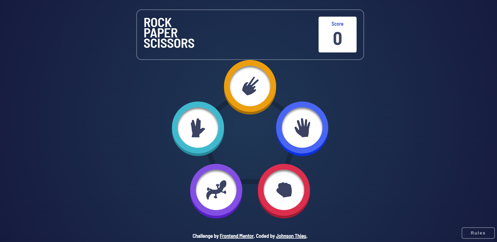

# Frontend Mentor - Rock, Paper, Scissors, Spock, Lizard solution

This is a solution to the [Rock, Paper, Scissors challenge on Frontend Mentor](https://www.frontendmentor.io/challenges/rock-paper-scissors-game-pTgwgvgH). Frontend Mentor challenges help you improve your coding skills by building realistic projects.

## Table of contents

- [Overview](#overview)
  - [The challenge](#the-challenge)
  - [Screenshot](#screenshot)
  - [Links](#links)
- [My process](#my-process)
  - [Built with](#built-with)
  - [What I learned](#what-i-learned)
- [Author](#author)

## Overview

### The challenge

Users should be able to:

- View the optimal layout for the game depending on their device's screen size
- Play Rock, Paper, Scissors, Spock, Lizard against the computer
- Maintain the state of the score after refreshing the browser _(optional)_
- **Bonus**: Play Rock, Paper, Scissors, Lizard, Spock against the computer _(optional)_

### Screenshot

- Landing Page
  

- User selected Paper, Count down starts
  

- User selected Paper, House randomly selected Paper
  

- User selected Scissors, House selected Rock
  

- User selected Rock, House selected Paper
  

### Links

- Solution URL: [GitHub](https://github.com/MyNameIsJohnson/react-scss-rock-paper-scissor)
- Live Site URL: [Rock, Papper, Scissors, Spock, Lizard](https://react-w-scss-rock-paper-scissors.onrender.com/)

## My process

### Built with

- [Node-Sass](https://www.npmjs.com/package/node-sass)
- Flexbox
- [React](https://reactjs.org/) - JS library
- [React Router Dom](https://www.npmjs.com/package/react-router-dom)

### What I learned

First project using node-sass. I really enjoyed building this game with sass.

More natural syntax and easy to read in most cases
Prevents the need to rewrite selectors multiple times
Better code organization and structure thanks to its visual hierarchy made it easy with more maintainable code.

Here is an example:

```css
.play {
  width: 100%;

  position: relative;
  display: flex;
  flex-direction: column;

  .items {
    display: flex;
    justify-content: center;

    .icon {
      height: 160px;
      width: 160px;
      border: 18px solid;
      border-radius: 50%;
      transition: transform 0.2s;

      &--paper {
        @include icon($imageP, $paper-gradient);
        transform: translateX(30rem) translateY(8rem);
        &:hover {
          transform: translateX(30rem) translateY(8rem) scale(1.5);
        }
      }
    }
  }
}
```

```js

```

## Author

- LinkedIn - [Johnson-Thieu](https://www.linkedin.com/in/johnson-thieu/)
